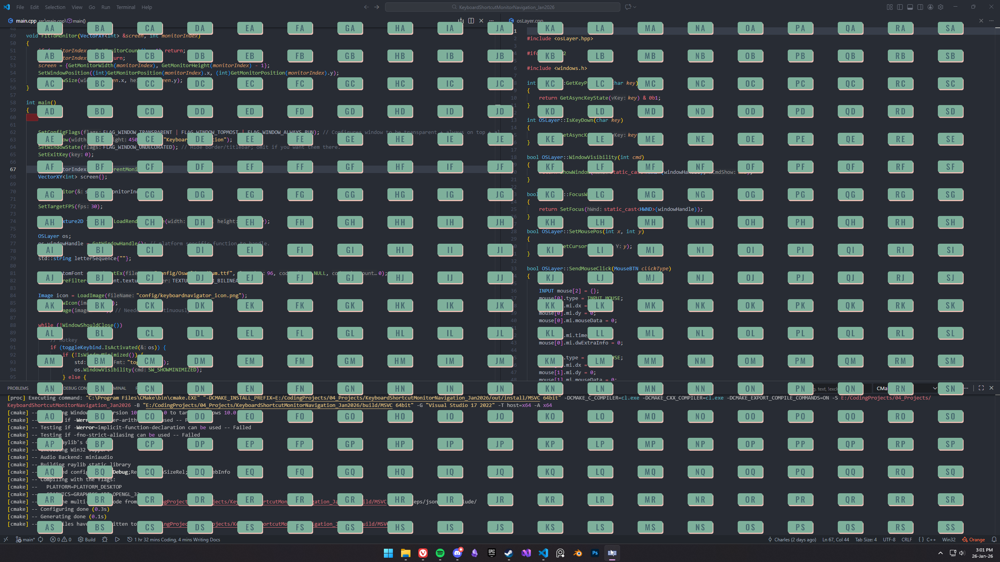
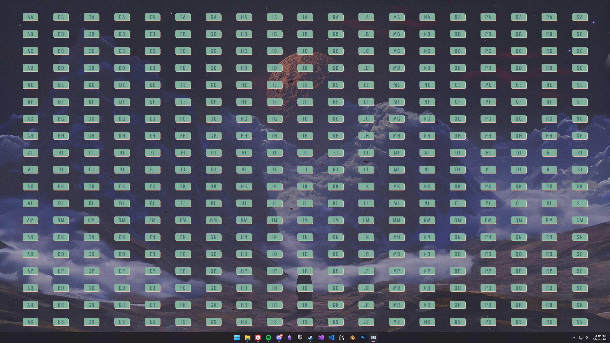

<div align="center">

# Keyboard Shortcut Monitor Navigation

</div>

## Overview
Keyboard Shortcut Monitor Navigation is a lightweight and efficient application designed to allow users to navigate windows swiftly with keyboard shortcuts. Built with C++ with Raylib

## Features
- **Cross-Platform Compatibility**: Aims to work on multiple operating systems. (Currently Windows only)
- **Lightweight**: Minimal resource usage for optimal performance.
- **Customizable Configurations**: Easily modify settings via `config.json`. (Planned)
- **Real-Time Monitoring**: Tracks keyboard shortcuts in real-time.
- **Extensible**: Modular design for adding new features.

## Getting Started
- Default hotkey: SHIFT+ALT+D
- Switch monitors: 1 through 9 keys
- Type the sequence of keys that appear where you want to click / focus.

### Prerequisites
- CMake (minimum version 3.50)
- A C++ compiler

<!-- ### Build Instructions
1. Clone the repository:
   ```bash
   git clone https://github.com/hqo998/KeyboardMonitorNavigation.git
   ```
2. Navigate to the project directory:
   ```bash
   cd KeyboardShortcutMonitorNavigation
   ```
3. Create a build directory and navigate into it:
   ```bash
   mkdir build && cd build
   ```
4. Run CMake to configure the project:
   ```bash
   cmake ..
   ```
5. Build the project:
   ```bash
   cmake --build .
   ```
6. Run the application:
   ```bash
   ./KeyboardNavigation
   ``` -->

## Configuration
The application uses a `config.json` file located in the `src/config/` directory. Modify this file to customize the behavior of the application.

> In-Progress... Please change global vars and recompile.

## Screenshots



## Dependencies
- [Raylib](https://www.raylib.com/) - For rendering window.
- [Nlohmann JSON](https://github.com/nlohmann/json) - For reading config file.

These dependencies are automatically downloaded and configured when built with the provided CMake configuration.
